# AIGroove - 관리자 백오피스 시스템

> AI 기반 음악 리듬 게임 플랫폼 **AIGroove**의 관리자 백오피스 시스템입니다.
> 인증, 사용자 관리, 콘텐츠 관리, AI 모델 운영 UI까지 플랫폼 전반을 관리하는 풀스택 백오피스를 단독 설계·구현했습니다.

<br>

## 프로젝트 개요

| 항목 | 내용 |
|---|---|
| **프로젝트명** | AIGroove - AI 기반 음악 리듬 게임 |
| **개발 기간** | 2025.03.03 ~ 2025.06.06 (3개월) |
| **팀 구성** | 4인 (가천대학교 종합프로젝트) |
| **담당 역할** | 관리자 백오피스 풀스택 단독 개발 (프론트엔드 + 백엔드 API/서비스) |
| **개발 규모** | REST API 33개 · React 페이지 20개 · JPA Entity 15개 · Service 9개 · DTO 15개 |
| **GitHub** | [Backend (Spring Boot)](https://github.com/kimhyeongjun-1204/aigroove) · [Admin Frontend (React)](https://github.com/kimhyeongjun-1204/aigroove-admin) |

<br>

## 핵심 성과

- 관리자 백오피스 **REST API 33개**와 React 20개 페이지를 단독 설계·구현
- JWT 인증 구조를 재점검해 **인가 검증 누락으로 인한 권한 상승 취약점**을 발견·수정
- 인증·인가 **통합 테스트 7건**을 작성하고, 수정한 코드를 되돌려 테스트가 실패하는지까지 검증
- JPA Fetch Join으로 목록 조회 **N+1 쿼리를 1회로** 축소
- AI 학습 API 연동 및 polling 기반 실시간 진행률 모니터링 구현

<br>

## 기술 스택

### Backend


-000000?style=for-the-badge&logo=jsonwebtokens&logoColor=white)

-85EA2D?style=for-the-badge&logo=swagger&logoColor=black)


### Frontend


<br>

## 아키텍처 및 담당 범위

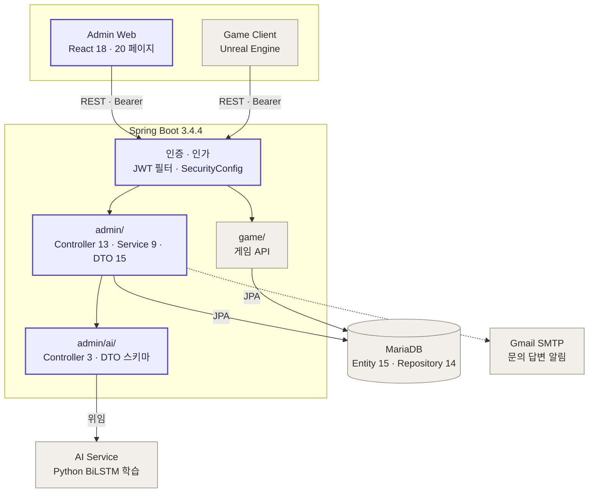

🟪 본인 담당 　⬜ 팀원 담당 · 인프라

| 영역 | 범위 | 담당 |
|---|---|---|
| Admin Frontend | React 20페이지 · 공통 컴포넌트 10 · Axios 인터셉터 | 단독 |
| Admin Backend | Controller 13 · Service 9 · DTO 15 (REST API 33개) | 단독 |
| 인증 · 인가 | SecurityConfig · JWT 필터 · 통합 테스트 7건 | 공동 |
| 공통 도메인 | Entity 15 · Repository 14 · N+1 최적화 | 단독 |
| AI 연동 계층 | Controller 3 · 학습 요청 JSON 스키마 설계 | 단독 (스키마는 AI 팀원과 협의) |
| AI 학습 서비스 | 모델 학습 로직 · Python 스크립트 | 팀원 |
| 게임 서버 · 클라이언트 | 멀티플레이 API · Unreal Engine | 팀원 |

<br>

## 주요 기능 및 화면

### 1. 로그인 / 회원가입

Spring Security + JWT 기반 Stateless 인증 시스템입니다. BCrypt 비밀번호 암호화, HMAC-SHA512 JWT 서명을 적용했습니다.

<p align="center">
  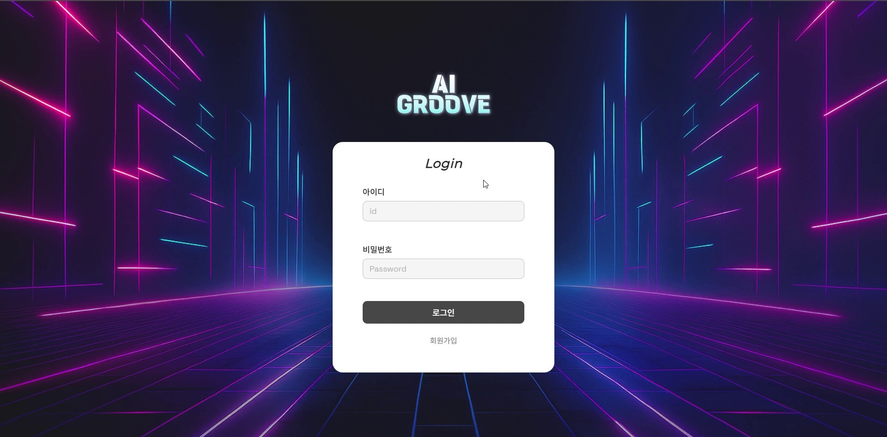
</p>

- `JwtUtils`에서 토큰 생성·검증, `JwtAuthenticationFilter`에서 요청 헤더의 Bearer 토큰 추출 및 인증 처리
- `SecurityConfig`에서 `/admin/**`은 `hasRole("ADMIN")` 요구, 로그인·회원가입·정적 리소스만 `permitAll`
- JWT에 발급 주체(`type`) 클레임을 담아 관리자 토큰과 게임 유저 토큰을 구분
- 프론트엔드 `ProtectedRoute` 컴포넌트로 미인증 사용자 리다이렉트, Axios 인터셉터로 401 응답 시 자동 로그아웃

---

### 2. 대시보드

서비스 핵심 KPI 6종과 시스템 로그를 한눈에 확인할 수 있는 메인 화면입니다.

<p align="center">
  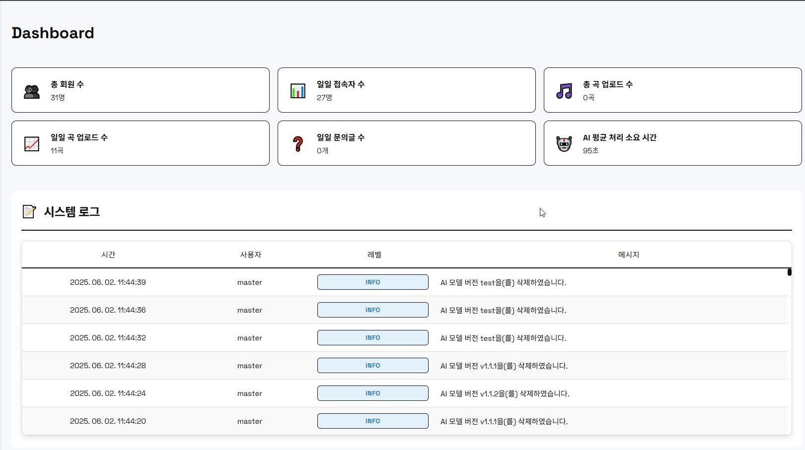
</p>

- 총 회원 수, 일일 접속자 수, 총 곡 업로드 수, 일일 곡 업로드 수, 일일 문의 건수, AI 모델 평균 처리 시간
- `DashboardSvc`에서 4개 Repository를 조합하여 단일 DTO로 집계
- 시스템 로그 최근 이력 조회 (관리자/사용자, 시간, 이벤트 레벨)

---

### 3. 문의사항 관리

사용자 문의를 접수하고 답변을 작성하면, JavaMailSender를 통해 이메일 알림이 자동 발송됩니다.

<p align="center">
  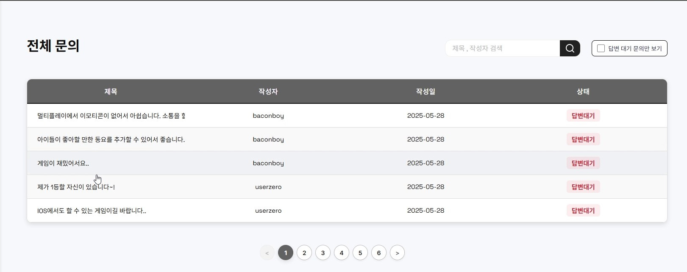
</p>
<p align="center">
  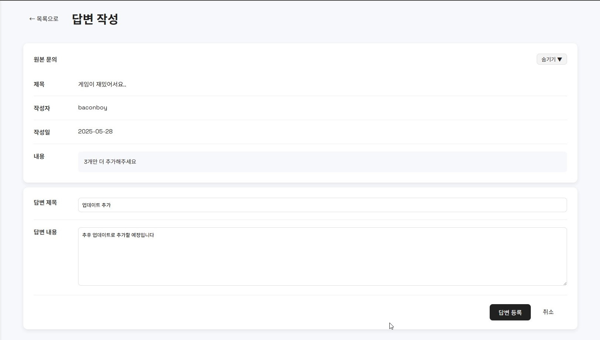
</p>
<p align="center">
  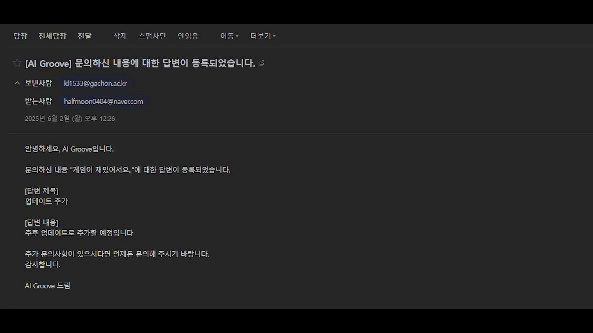
</p>

- 전체 문의 목록 조회 (제목, 작성자, 작성일, 답변 상태), 제목/작성자 검색
- 답변 작성 시 `EmailService`가 `MimeMessageHelper`로 UTF-8 이메일 구성 후 Gmail SMTP 자동 발송
- 답변 등록·메일 발송·로그 기록이 하나의 `@Transactional` 내에서 처리

---

### 4. 공지사항 관리

공지사항 CRUD를 구현했습니다. 관리자 웹에서 작성된 공지가 게임 클라이언트 앱에 반영됩니다.

<p align="center">
  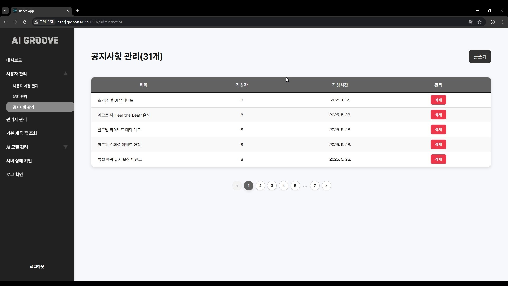
</p>

- 공지사항 작성, 수정, 삭제 (작성자·작성시간 자동 기록)
- `@Valid` + `BindingResult` 기반 입력값 검증
- 모든 CRUD 작업 시 `LogSvc`를 통해 관리자 활동 로그 자동 기록

---

### 5. 관리자 관리 (승인 시스템)

신규 관리자 가입 요청을 기존 관리자가 승인/거절하는 프로세스를 구현했습니다.

<p align="center">
  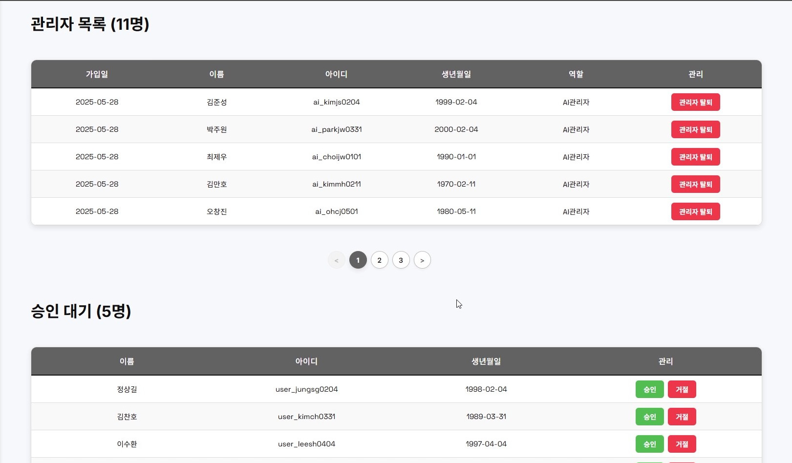
</p>

- 승인된 관리자 목록 / 승인 대기 목록 분리 표시
- 승인 시 역할(MASTER/USER/AI) 지정 가능
- `signupDate == null` 여부로 승인 상태 판별하는 도메인 로직 설계

---

### 6. AI 데이터셋 관리

AI 모델 학습용 데이터셋의 업로드·다운로드·삭제 UI를 구현하고, 백엔드 AI 서비스와 연동하는 API 계층을 설계했습니다.

<p align="center">
  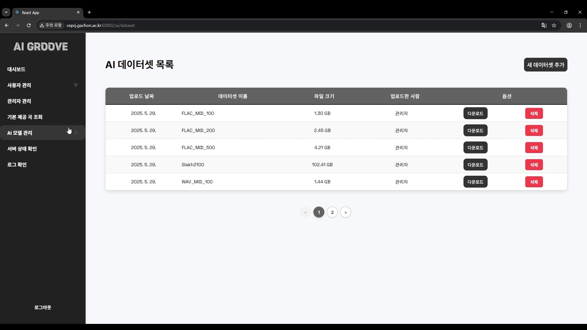
</p>

- 데이터셋 목록 조회 (이름, 크기, 업로더)
- 프론트엔드에서 대용량 파일을 1MB 청크로 분할하여 Base64 전송, 백엔드에서 재조립
- 데이터셋 다운로드 시 zip 파일 스트리밍 응답

---

### 7. AI 학습 실행

데이터셋을 선택하고 하이퍼파라미터를 설정하여 AI 모델 학습을 요청합니다. 학습 진행률을 실시간으로 모니터링하는 프론트엔드 UI와, 백엔드 학습 서비스에 요청을 전달하는 API 계층을 구현했습니다.

<p align="center">
  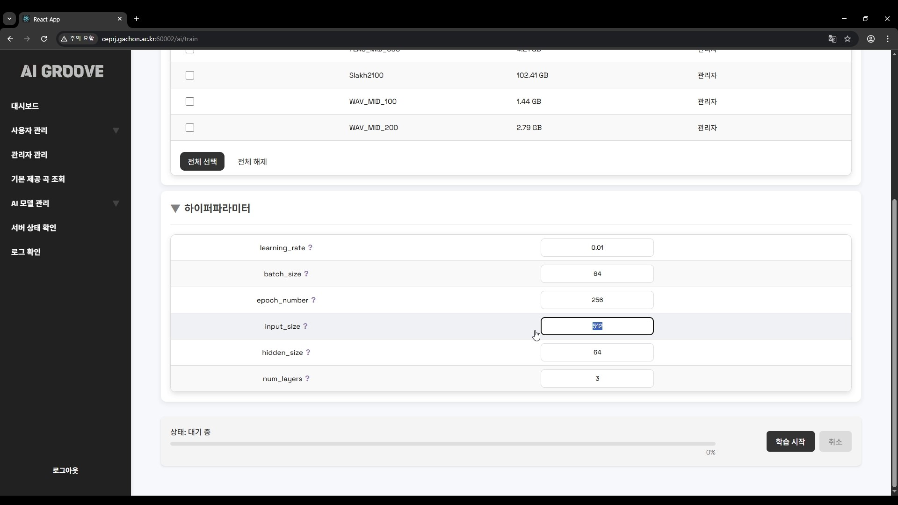
</p>
<p align="center">
  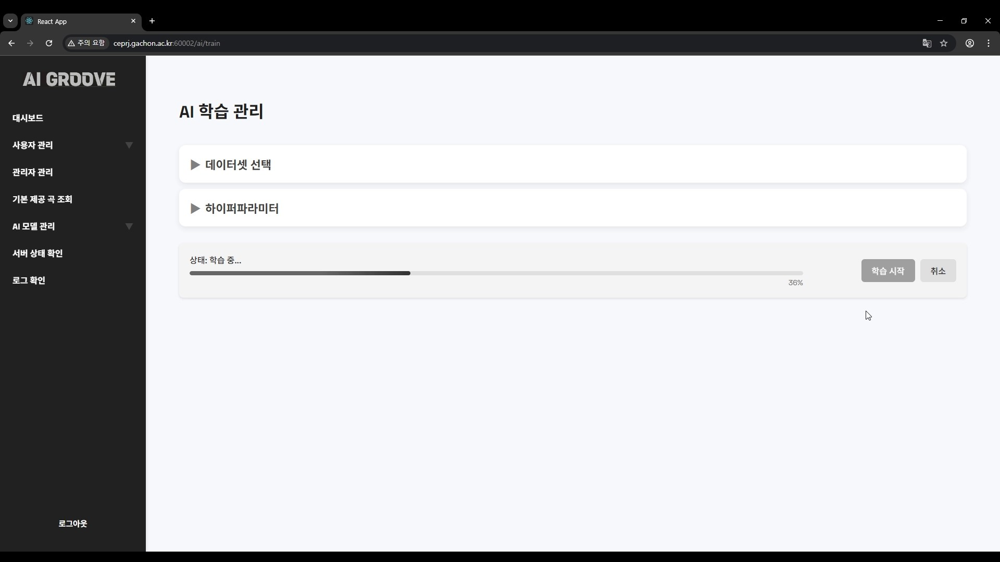
</p>

- 학습 데이터셋 선택 (체크박스), 하이퍼파라미터 6종 설정 UI (learning_rate, batch_size, epoch_number, input_size, hidden_size, num_layers)
- AI 팀원과 협의하여 학습 요청 JSON 스키마(`TrainingRequestDTO`, `TrainingParams`) 설계
- 학습 진행률 1초 간격 polling + 프로그래스 바 실시간 시각화
- 학습 완료 시 버전 정보 입력 모달 → 모델 버전 관리 페이지로 이동

---

### 8. AI 모델 버전 관리

학습 완료된 AI 모델의 버전별 성능 지표를 시각적으로 관리합니다.

<p align="center">
  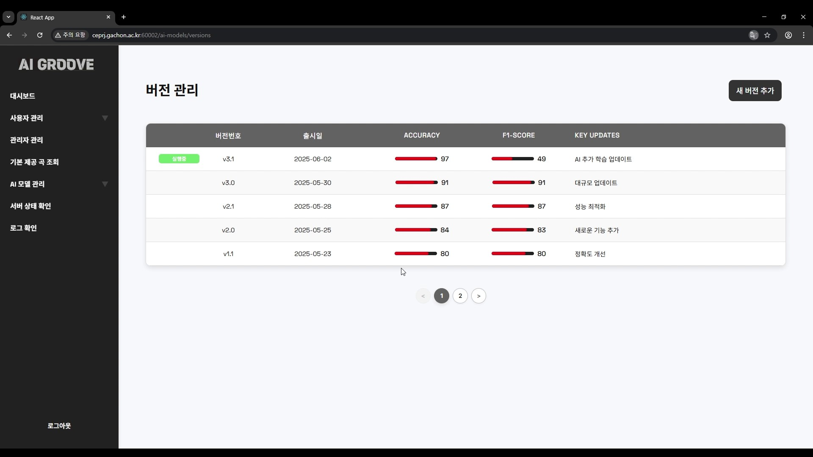
</p>

- 버전 목록 (출시일, Accuracy, F1-Score 표시), 성능 지표 바 그래프 시각화
- 활성 버전 배지 표시 및 전환 기능
- 모델 상세 조회 시 학습 파라미터·사용 데이터셋 확인

---

### 9. 서버 상태 모니터링

JVM `ManagementFactory` API를 활용하여 서버 리소스를 실시간 조회합니다.

<p align="center">
  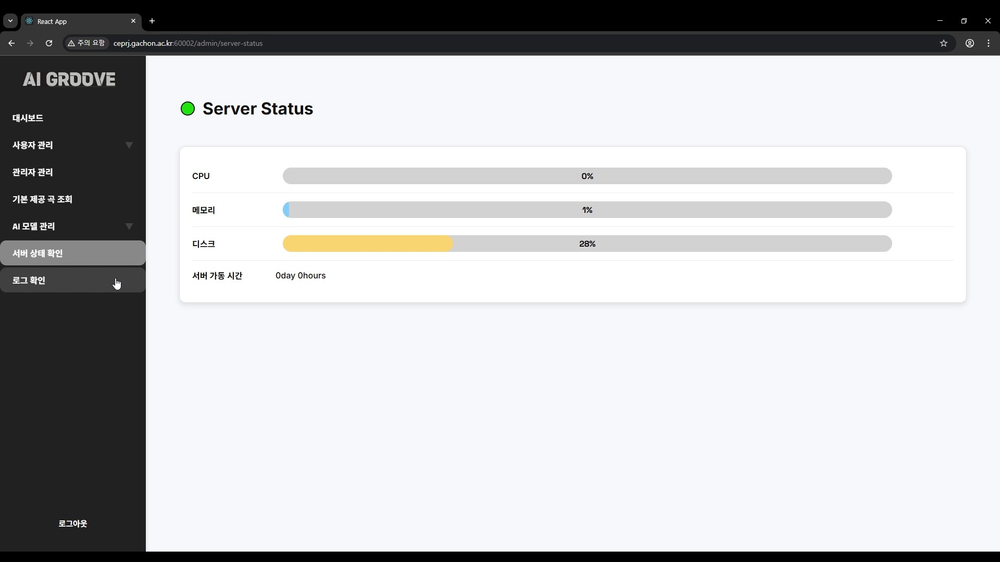
</p>

- `OperatingSystemMXBean`으로 CPU 사용률, `MemoryMXBean`으로 힙 메모리 사용률, `File` API로 디스크 사용률 조회
- 서버 가동 시간 (`RuntimeMXBean.getUptime()`) 표시

<br>

## API 명세 (실제 구현 기준 · 총 33개)

### 인증 (3개)
| Method | Endpoint | 설명 |
|---|---|---|
| POST | `/admin/login` | 관리자 로그인 (JWT 발급) |
| POST | `/admin/signup` | 관리자 회원가입 요청 |
| POST | `/admin/logout` | 관리자 로그아웃 |

### 대시보드 (1개)
| Method | Endpoint | 설명 |
|---|---|---|
| GET | `/admin/dashboard` | KPI 6종 + 로그 목록 조회 |

### 관리자 관리 (3개)
| Method | Endpoint | 설명 |
|---|---|---|
| GET | `/admin/admin` | 관리자 목록 조회 (승인/대기 분류) |
| POST | `/admin/admin/accept` | 관리자 승인 (역할 지정) |
| DELETE | `/admin/admin/delete` | 관리자 삭제 / 승인 거절 |

### 사용자 관리 (3개)
| Method | Endpoint | 설명 |
|---|---|---|
| GET | `/admin/user` | 사용자 목록 조회 |
| GET | `/admin/user/search?keyword=` | 사용자 검색 (아이디/닉네임/이메일) |
| DELETE | `/admin/user/delete/{userId}` | 사용자 탈퇴 처리 (소프트 삭제) |

### 문의사항 관리 (3개)
| Method | Endpoint | 설명 |
|---|---|---|
| GET | `/admin/inquiry` | 문의 목록 조회 + 검색 |
| GET | `/admin/inquiry/{inquiryId}` | 문의 상세 조회 |
| POST | `/admin/inquiry/{inquiryId}/answer` | 답변 등록 + 이메일 발송 |

### 공지사항 관리 (5개)
| Method | Endpoint | 설명 |
|---|---|---|
| GET | `/admin/notice` | 공지사항 목록 조회 |
| GET | `/admin/notice/{noticeId}` | 공지사항 상세 조회 |
| POST | `/admin/notice` | 공지사항 작성 |
| PUT | `/admin/notice/{noticeId}` | 공지사항 수정 |
| DELETE | `/admin/notice/{noticeId}` | 공지사항 삭제 |

### AI 데이터셋 관리 (5개) — API 계층 설계, 서비스 로직은 AI 팀원과 협업
| Method | Endpoint | 설명 |
|---|---|---|
| GET | `/admin/dataset/all` | 데이터셋 목록 조회 |
| GET | `/admin/dataset/latest-version` | 최신 모델 버전 조회 |
| POST | `/admin/ai/dataset` | 데이터셋 청크 업로드 |
| GET | `/admin/ai/dataset/download` | 데이터셋 다운로드 (zip 스트리밍) |
| DELETE | `/admin/dataset` | 데이터셋 삭제 |

### AI 모델 관리 (5개) — API 계층 설계, 서비스 로직은 AI 팀원과 협업
| Method | Endpoint | 설명 |
|---|---|---|
| GET | `/admin/ai/model/all` | 모델 버전 목록 조회 |
| GET | `/admin/ai/model/detail` | 모델 상세 (파라미터, 데이터셋, 성능) |
| POST | `/admin/ai/model` | 학습 요청 저장 |
| POST | `/admin/ai/model/select` | 활성 모델 선택 |
| DELETE | `/admin/ai/model/delete` | 모델 삭제 |

### AI 학습 실행 (2개) — API 계층 설계, 서비스 로직은 AI 팀원과 협업
| Method | Endpoint | 설명 |
|---|---|---|
| POST | `/admin/ai/train` | AI 학습 실행 요청 |
| GET | `/admin/ai/train/progress` | 학습 진행률 조회 |

### 콘텐츠 & 시스템 (3개)
| Method | Endpoint | 설명 |
|---|---|---|
| GET | `/admin/defaultsongs` | 기본 제공 곡 목록 조회 |
| GET | `/admin/logs` | 시스템 로그 조회 |
| GET | `/admin/server/status` | 서버 CPU/메모리/디스크 사용률 조회 |

> 전체 API 문서는 서버 실행 후 Swagger UI에서 확인 가능: `http://localhost:8080/swagger-ui/index.html`

<br>

## 프로젝트 구조

### Backend
```
src/main/java/com/game4men/aigroove/
├── AigrooveApplication.java
│
├── admin/                                  # ⭐ 관리자 모듈 (담당)
│   ├── controller/
│   │   ├── LoginController.java               # 로그인/회원가입/로그아웃 (3 API)
│   │   ├── DashboardController.java           # 대시보드 KPI (1 API)
│   │   ├── AdminController.java               # 관리자 관리 (3 API)
│   │   ├── AdminUserController.java           # 사용자 관리 (3 API)
│   │   ├── InquiryController.java             # 문의사항 관리 (3 API)
│   │   ├── NoticeController.java              # 공지사항 CRUD (5 API)
│   │   ├── LogController.java                 # 로그 조회 (1 API)
│   │   ├── DefaultSongController.java         # 기본 곡 조회 (1 API)
│   │   ├── ServerStatusController.java        # 서버 상태 (1 API)
│   │   ├── WebController.java                 # SPA 라우팅 포워딩
│   │   ├── AiDatasetController.java           # AI 데이터셋 API (5 API) *
│   │   ├── AiModelController.java             # AI 모델 API (5 API) *
│   │   └── AiTrainController.java             # AI 학습 API (2 API) *
│   │                                          # * API 계층 설계 담당, 서비스 로직은 AI 팀원 협업
│   ├── dto/
│   │   ├── LoginRequest.java, LoginResponse.java
│   │   ├── SignupRequest.java, SignupResponse.java
│   │   ├── AdminResponse.java, AdminListResponse.java
│   │   ├── UserResponse.java
│   │   ├── InquiryResponse.java
│   │   ├── DashboardDto.java, LogResponseDto.java
│   │   ├── DatasetInfoDTO.java, ModelResponseDto.java
│   │   └── TrainingRequestDTO.java, TrainingParams.java, TrainingSaveFormat.java
│   └── service/
│       ├── LoginSvc.java                      # JWT 인증 로직
│       ├── DashboardSvc.java                  # 대시보드 KPI 집계
│       ├── AdminSvc.java                      # 관리자 CRUD + 승인
│       ├── AdminUserSvc.java                  # 사용자 관리 + 검색
│       ├── InquirySvc.java                    # 문의 처리 + 이메일 연동
│       ├── NoticeSvc.java                     # 공지사항 CRUD
│       ├── EmailService.java                  # Gmail SMTP 이메일 발송
│       ├── LogSvc.java                        # 활동 로그 기록/조회
│       ├── ServerStatusSvc.java               # CPU/메모리/디스크 조회
│       ├── AiDatasetSvc.java                  # (AI 팀원 담당)
│       ├── AiModelSvc.java                    # (AI 팀원 담당)
│       └── AiTrainSvc.java                    # (AI 팀원 담당)
│
├── game/                                   # 게임 모듈 (팀원 담당)
│   └── ...
│
└── common/                                 # ⭐ 공통 모듈 (담당)
    ├── config/
    │   ├── SecurityConfig.java                # Spring Security + CORS + JWT 필터 등록
    │   └── SwaggerConfig.java                 # Swagger API 문서 설정
    ├── entity/                                # JPA Entity 15개
    │   ├── Admin.java                         # 관리자 (Role: MASTER/USER/AI)
    │   ├── User.java                          # 사용자
    │   ├── Inquiry.java                       # 문의사항
    │   ├── Notice.java                        # 공지사항
    │   ├── Log.java                           # 시스템 로그
    │   ├── DailyLog.java                      # 일일 집계 로그
    │   ├── ModelInfo.java                     # AI 모델 정보
    │   ├── DatasetInfo.java                   # AI 데이터셋 정보
    │   ├── DefaultSong.java                   # 기본 제공 곡
    │   ├── GameRoom.java                      # 게임 방
    │   ├── GameStatus.java                    # 게임 상태
    │   ├── SongInfo.java                      # 곡 정보
    │   ├── PlayFile.java                      # 플레이 파일
    │   ├── Ranking.java                       # 랭킹
    │   └── Badge.java                         # 뱃지
    ├── repository/                            # JPA Repository 14개
    │   ├── AdminRepository.java
    │   ├── LoginRepository.java
    │   ├── UserRepository.java
    │   ├── InquiryRepository.java
    │   ├── NoticeRepository.java
    │   ├── LogRepository.java
    │   ├── DailyLogRepository.java
    │   ├── ModelInfoRepository.java
    │   ├── DatasetInfoRepository.java
    │   ├── DefaultSongRepository.java
    │   ├── SongInfoRepository.java
    │   ├── GameRoomRepository.java
    │   ├── GameStatusRepository.java
    │   └── BadgeRepository.java
    └── utils/
        ├── JwtUtils.java                      # JWT 토큰 생성/검증 (HMAC-SHA512)
        └── JwtAuthenticationFilter.java       # Bearer 토큰 추출 + 인증 필터
```

### Frontend
```
src/
├── App.js                                  # React Router 라우팅 설정 (20개 라우트)
├── index.js
│
├── config/
│   └── config.js                           # API Base URL 환경 설정
├── services/
│   ├── api.js                              # Axios 인스턴스 (인터셉터: JWT 토큰 자동 첨부, 401 처리)
│   └── authService.js                      # 로그인/로그아웃/토큰 관리 (6개 함수)
│
├── components/
│   ├── js/
│   │   ├── Login.js                        # 로그인
│   │   ├── Signup.js                       # 회원가입
│   │   ├── SignupSuccess.js                # 가입 완료 안내
│   │   ├── Intro.js                        # 인트로 페이지
│   │   ├── Dashboard.js                    # 대시보드 (KPI 6종 + 로그)
│   │   ├── AdminManagement.js              # 관리자 관리 (승인/거절/삭제)
│   │   ├── UserManagement.js               # 사용자 관리 (검색/삭제)
│   │   ├── InquiryManagement.js            # 문의 목록 (검색/필터)
│   │   ├── InquiryDetail.js                # 문의 상세
│   │   ├── InquiryAnswer.js                # 문의 답변 작성
│   │   ├── NoticeManagement.js             # 공지사항 목록
│   │   ├── NoticeWrite.js                  # 공지사항 작성 / 상세
│   │   ├── NoticeEdit.js                   # 공지사항 수정
│   │   ├── DatasetList.js                  # AI 데이터셋 목록
│   │   ├── DatasetAdd.js                   # AI 데이터셋 업로드 (청크 분할)
│   │   ├── AITrainManager.js               # AI 학습 실행 (파라미터 설정 + 실시간 진행률)
│   │   ├── VersionManagement.js            # AI 모델 버전 관리
│   │   ├── DefaultSongTable.js             # 기본 곡 목록
│   │   ├── LogViewer.js                    # 시스템 로그 조회
│   │   ├── ServerStatus.js                 # 서버 상태 모니터링
│   │   ├── IntroHeader.js                  # 인트로 헤더 컴포넌트
│   │   ├── UserDetailModal.js              # 사용자 상세 모달
│   │   ├── ModelDetailModal.js             # 모델 상세 모달
│   │   └── side/                           # 공통 재사용 컴포넌트
│   │       ├── Sidebar.js                  # 사이드바 네비게이션
│   │       ├── TopHeader.js                # 상단 헤더 (사용자 정보)
│   │       ├── Pagination.js               # 페이지네이션
│   │       ├── SearchBox.js                # 검색 박스
│   │       ├── ConfirmPopup.js             # 확인 팝업
│   │       ├── ErrorPopup.js               # 에러/알림 팝업
│   │       └── ProtectedRoute.js           # JWT 인증 라우트 가드
│   └── css/                                # 26개 CSS 파일
│       ├── Login.css, Signup.css, Dashboard.css ...
│       └── side/                           # 공통 컴포넌트 스타일
└── types/
    └── admin.ts                            # 타입 정의
```

<br>

## 핵심 구현 사항

### JWT 기반 Stateless 인증 시스템
`JwtUtils`에서 HMAC-SHA512 서명으로 토큰을 생성하고, `JwtAuthenticationFilter`(OncePerRequestFilter)에서 Bearer 토큰을 추출·검증합니다. `SecurityConfig`에서 `SessionCreationPolicy.STATELESS`로 세션을 사용하지 않습니다. 프론트엔드에서는 Axios 요청 인터셉터로 토큰을 자동 첨부하고, 응답 인터셉터로 401 수신 시 자동 로그아웃 처리합니다.

**인증과 인가의 역할 분리** — 필터는 인증만 담당합니다. 토큰이 유효하면 `SecurityContextHolder`에 권한 정보를 저장하고, 유효하지 않으면 아무것도 하지 않은 채 다음 필터로 넘깁니다. 접근 거부 여부는 `SecurityConfig`의 인가 규칙이 판단합니다. 필터가 직접 응답을 만들면 공개 경로 목록을 필터와 설정 양쪽에서 관리하게 되어 두 곳이 어긋날 수 있기 때문입니다.

**토큰 발급 주체 구분** — 관리자(`admin`)와 게임 유저(`user`)는 별도 테이블이라 username이 겹칠 수 있습니다. JWT에 `type` 클레임(`ADMIN` / `USER`)을 담아 필터가 조회할 테이블을 확정하고, 관리자에게는 `ROLE_ADMIN`과 세부 역할(`MASTER` / `AI` / `USER`)을 함께 부여합니다.

**상태 코드 구분** — `authenticationEntryPoint`를 지정해 인증 정보가 없는 요청은 401, 인증됐지만 권한이 부족한 요청은 403을 반환합니다. (스프링 시큐리티 기본값은 두 경우 모두 403)

```java
.requestMatchers("/admin/login", "/admin/signup").permitAll()
.requestMatchers("/api/game/user/login", "/api/game/user/signup").permitAll()
.requestMatchers("/api/game/notice/**", "/api/game/ranking/**").permitAll()
.requestMatchers("/api/game/**").authenticated()
.requestMatchers("/swagger-ui/**", "/v3/api-docs/**").permitAll()
.requestMatchers("/", "/index.html", "/static/**", "/*.js", "/*.css", "/*.ico", "/*.png", "/*.json").permitAll()
.requestMatchers("/admin/**").hasRole("ADMIN")
```

### 관리자 승인 프로세스 (3단계 역할)
신규 관리자가 회원가입하면 `signupDate = null` 상태로 저장됩니다. 기존 관리자(MASTER)가 승인 처리 시 `signupDate`를 설정하고 역할(MASTER/USER/AI)을 부여합니다. `signupDate == null`이면 로그인 자체가 거부되어 무분별한 관리자 계정 생성을 방지합니다.

### 문의 답변 이메일 알림 시스템
답변 등록 시 `InquirySvc.answerInquiry()` 내에서 답변 상태 업데이트 → `EmailService`로 이메일 발송 → `LogSvc`로 활동 로그 기록이 하나의 `@Transactional` 안에서 처리됩니다. `MimeMessageHelper`로 UTF-8 이메일을 구성하여 Gmail SMTP를 통해 발송합니다.

### 관리자 활동 로그 시스템
공지사항 CRUD, 문의 답변, AI 모델 선택/삭제, 사용자 관리, 데이터셋 업로드/삭제 등 주요 관리 작업마다 `LogSvc.saveLog()`를 호출하여 관리자명·시간·작업내용·로그레벨(INFO/WARN/ERROR)을 자동 기록합니다.

### AI 학습 API 연동 (팀원 협업)
AI 팀원과 학습 요청 JSON 스키마(`TrainingRequestDTO` + `TrainingParams`)를 협의하여 설계하고, 프론트엔드에서 하이퍼파라미터 설정 UI → POST 요청 → 1초 간격 진행률 polling → 완료 시 버전 관리 페이지 이동까지의 전체 UX 플로우를 구현했습니다.

<br>

## 성능 최적화

### JPA N+1 문제 해결

목록 조회 API에서 Lazy Loading으로 인한 N+1 문제를 발견하고, JPQL Fetch Join으로 최적화했습니다.

| 대상 | 관계 | 최적화 전 | 최적화 후 | 방법 |
|---|---|---|---|---|
| 로그 목록 | `Log` → `Admin` / `User` | 1 + N회 | **1회** | `LEFT JOIN FETCH l.admin LEFT JOIN FETCH l.user` |
| 문의 목록 | `Inquiry` → `User` / `Admin` | 1 + N회 | **1회** | `LEFT JOIN FETCH i.user LEFT JOIN FETCH i.answeredAdmin` |
| 공지 목록 | `Notice` → `Admin` | 1 + N회 | **1회** | `JOIN FETCH n.author` |
| 데이터셋 목록 | `DatasetInfo` → `Admin` | 1 + N회 | **1회** | `LEFT JOIN FETCH d.uploader` |

### 대시보드 집계 쿼리 최적화

총 곡 업로드 수 계산에서 전체 User를 메모리에 로드하여 Java Stream으로 합산하던 로직을 DB 집계 쿼리로 변경했습니다.

```java
// 최적화 전: User 테이블 전체 로드 후 Java에서 합산
long total = userRepository.findAll().stream()
                .mapToInt(User::getUploadedSongCount).sum();

// 최적화 후: DB에서 SUM 집계 (단일 쿼리)
@Query("SELECT COALESCE(SUM(u.uploadedSongCount), 0) FROM User u")
Long sumUploadedSongCount();
```

<br>

## 테스트

인증·인가는 필터·시큐리티 설정·컨트롤러가 함께 동작해야 결과가 결정되므로, 단위 테스트로는 검증이 어렵다고 판단해 `@SpringBootTest` + `MockMvc` 통합 테스트로 작성했습니다.

| 검증 항목 | 요청 | 기대 |
|---|---|---|
| 인증 없음 | 토큰 없이 `GET /admin/dashboard` | 401 |
| 위조 토큰 | 서명이 다른 토큰 | 401 |
| **권한 부족** | 게임 유저 토큰으로 `GET /admin/dashboard` | **403** |
| 정상 접근 | 관리자 토큰으로 `GET /admin/dashboard` | 200 |
| 게임 API 보호 | 토큰 없이 `GET /api/game/badge/status/all` | 401 |
| 입력값 검증 | 빈 제목으로 `PUT /admin/notice/{id}` | 400 + 검증 메시지 |

`@BeforeEach`에서 관리자와 게임 유저에게 **같은 username을 부여**합니다. `admin`과 `user`가 별도 테이블이라 이름이 겹칠 수 있고, 실제로 그 상황에서 권한 상승이 가능했기 때문에 그 조건을 테스트 환경에 재현해 두었습니다.

```java
@BeforeEach
void setUp() {
    // 관리자와 게임 유저가 같은 username을 사용하는 상황을 만든다
    admin.setUsername(SHARED_USERNAME);
    user.setUsername(SHARED_USERNAME);

    adminToken    = jwtUtils.generateToken(SHARED_USERNAME, "ADMIN");
    gameUserToken = jwtUtils.generateToken(SHARED_USERNAME, "USER");
}
```

**테스트가 유효한지 확인** — 작성 후 `SecurityConfig`의 `hasRole("ADMIN")`을 `authenticated()`로 되돌린 상태에서 실행했고, 권한 부족 테스트만 실패하는 것을 확인한 뒤 원복했습니다.

```
Status expected:<403> but was:<200>
```

통과만 보고는 그 테스트가 실제로 무엇을 검증하는지 알 수 없다고 판단해 이 과정을 거쳤습니다. 실제로 초기 작성 시 요청에 토큰을 싣는 코드를 빠뜨렸는데도 테스트가 통과한 경우가 있었습니다.

```bash
./gradlew test --tests "*AdminAuthIntegrationTest*"
```

테스트는 로컬 MariaDB를 사용하며, 생성한 데이터는 `@Transactional`로 롤백됩니다. 대시보드 집계에 `SUM`·`COALESCE` 같은 DB 함수를 쓰고 있어 H2로 대체하면 방언 차이가 생길 수 있다고 보고 운영과 같은 DBMS를 사용했습니다.

<br>

## 트러블슈팅

### 1. AI 학습 진행률 조회 시 404 에러

**문제**: AI 학습 실행(POST) 직후 진행률 조회(GET)를 요청하면 `_status.json` 파일이 없다는 에러가 발생했습니다.

**원인**: 학습 실행 API가 Python 스크립트를 비동기로 실행하는 구조에서, Python이 `_status.json`을 생성하기 전에 프론트엔드가 진행률 조회를 요청하는 **비동기 타이밍 이슈**였습니다.

**해결**: AI 팀원과 함께 Python 스크립트의 파일 생성 시점을 분석한 후, 두 가지를 적용했습니다.

클라이언트: POST 요청 후 1초 딜레이를 두고 polling 시작
```javascript
// AITrainManager.js (line 129, 166)
const response = await axios.post(`${SERVER_URL}/admin/ai/train`, payload);
const trainId = response.data;

// 1초 후 첫 polling 시작 (Python _status.json 생성 대기)
setTimeout(checkProgress, 1000);
```

서버: `_status.json`이 아직 없으면 404 대신 "waiting" 상태를 반환하는 방어 로직 추가
```java
// AiTrainSvc.java (line 114-120)
if (!Files.exists(path)) {
Map<String, Object> statusMap = new HashMap<>();
    statusMap.put("train_status", "waiting");
    return objectMapper.writeValueAsString(statusMap);
}
```

---

### 2. Spring Security + React SPA 통합 배포 시 인증 충돌

**문제**: React 빌드를 Spring Boot에 통합하여 학과 서버(Linux)에 배포했을 때, `/admin/dashboard` 같은 React 라우트에 접속하면 `AnonymousAuthenticationFilter` 오류가 발생하고, 새로고침 시 404가 반환되었습니다.

**원인**: 복합적이었습니다.
1. **Security 인증 충돌**: Spring Security가 React 클라이언트 라우팅 경로(`/admin/dashboard`)를 API 엔드포인트로 인식하여 인증을 요구
2. **SPA 라우팅 미처리**: 새로고침 시 브라우저가 서버에 직접 URL을 요청하지만, 해당 경로에 실제 리소스가 없어 404 발생
3. **포트 점유**: 기존 버전(v0.4)이 같은 포트(60002)를 점유

**해결**: 팀원과 함께 포트 점유 확인(Process kill), Linux 파일 권한 확인 등 환경 문제를 먼저 제거한 후, 다음 2가지를 수정했습니다.

`SecurityConfig.java`에서 정적 리소스와 인증 불필요 경로를 허용:
```java
.requestMatchers("/admin/login", "/admin/signup").permitAll()
.requestMatchers("/", "/index.html", "/static/**", "/*.js", "/*.css", "/*.ico").permitAll()
.requestMatchers("/admin/**").authenticated()
```

`WebController.java`에서 확장자가 없는 경로를 `index.html`로 포워딩:
```java
// 정규표현식으로 확장자 없는 경로만 매칭 → SPA 라우팅 지원
@RequestMapping(value = {"/{path:[^\\.]*}", "/**/{path:[^\\.]*}"})
public String redirect() {
    return "forward:/index.html";
}
```

> 처음에는 `WebConfig.java`의 `addViewController`에서 시도했으나 정적 파일까지 포워딩되는 문제가 있어, 별도 `@Controller`로 분리하고 정규표현식으로 확장자 있는 경로를 제외했습니다.
>
> 이후 `WebConfig`는 남은 역할이 없어져 제거했고, CORS 설정은 `SecurityConfig`로 통합했습니다.
> 위 인가 규칙도 현재는 `/admin/**`에 `hasRole("ADMIN")`을 적용하는 형태로 바뀌었습니다.

---

### 3. 배포 환경에서 API 요청 실패 (Base URL 불일치)

**문제**: 학과 서버(`ceprj.gachon.ac.kr:60002`)에 배포 후 API 호출 시 `ERR_CONNECTION_REFUSED` 에러가 발생했습니다.

**원인**: React `config.js`에 Base URL이 `http://localhost:60002`로 하드코딩되어 있어, 배포 서버에서 사용자 브라우저가 자신의 PC에서 60002 포트를 찾으려 했습니다.

**해결**: `config.js`의 `SERVER_URL`을 빈 문자열(상대 경로)로 변경하여, React 빌드가 Spring Boot에서 서빙될 때 same-origin으로 API를 호출하도록 수정했습니다.
```javascript
// config.js
export const SERVER_URL = ''; // 상대 경로 → 배포 서버 자기 자신으로 요청
```

모든 API 호출이 `${SERVER_URL}/admin/...` 패턴으로 통일되어 있어, 이 한 곳만 수정하면 전체 환경 전환이 가능합니다.

---

### 4. JPA 쿼리 중복 결과 오류 (NonUniqueResultException)

**문제**: 운영 중 `Query did not return a unique result: 2 results were returned` 에러가 발생했습니다.

**원인**: Repository에서 `Optional<Entity>`를 반환하는 쿼리 메서드를 사용했는데, DB에 동일 조건의 데이터가 2건 이상 존재했습니다.

**해결**: 두 가지 방어 전략을 적용했습니다.
1. **`findTop` 패턴 적용**: 결과가 여러 건이어도 첫 번째만 반환하도록 `findTopByOrderBy...Desc()` 메서드로 변경 (AdminRepository, LoginRepository, NoticeRepository, ModelInfoRepository 총 4곳)
2. **비즈니스 로직으로 중복 방지**: `AiModelSvc.selectModel()`에서 전체 모델을 `selected=false`로 초기화한 뒤 선택 모델만 `true`로 설정하여 `selected=true`가 중복되는 상황을 원천 차단

---

### 5. 인가 검증 누락으로 인한 권한 상승

**문제**: 관리자 API에 인증을 적용한 뒤 직접 요청을 보내 확인하던 중, **게임 유저 토큰으로도 `/admin/dashboard`가 200을 반환**하는 것을 발견했습니다. 사용자 통계와 시스템 로그가 그대로 노출됐습니다.

**원인**: 세 가지가 겹쳐 있었습니다.

1. `admin`과 `user`는 별도 테이블이고 각자 중복 검사만 하므로 **username이 겹칠 수 있음**. 게임 회원가입은 공개 API라 관리자와 같은 이름으로 가입이 가능했습니다.
2. 두 로그인이 발급하는 JWT가 형식이 같아 **토큰만으로는 발급 주체를 구분할 수 없음**
3. `/admin/**`이 `.authenticated()`만 요구해, **이름이 겹치지 않아도 인증된 게임 유저면 통과**

`.authenticated()`는 "인증된 사용자인가"만 검사하고 어떤 권한인지는 보지 않습니다. 인증(Authentication)과 인가(Authorization)를 구분하지 않은 것이 원인이었습니다.

**해결**: 토큰에 발급 주체를 담고, 인가 조건을 권한 기반으로 바꿨습니다.

```java
// 1) 발급 시 주체를 클레임에 기록 — 서명에 포함되므로 위조 불가
.claim("type", type)      // "ADMIN" | "USER"

// 2) 필터는 토큰이 가리키는 테이블에서만 조회 (이름이 겹쳐도 교차 인증되지 않음)
if ("ADMIN".equals(type)) {
Admin admin = loginRepository.findByUsername(username).orElse(null);
    authorities.add("ROLE_ADMIN");
    authorities.add("ROLE_" + admin.getRole().name());
        }

// 3) 인가 조건을 권한 기반으로 전환
        .requestMatchers("/admin/**").hasRole("ADMIN")
```

관리자와 게임 유저에게 같은 username을 부여한 상태로 재검증했습니다.

| 요청 | 수정 전 | 수정 후 |
|---|---|---|
| 토큰 없이 `/admin/dashboard` | 403 | **401** |
| **게임 유저 토큰** | **200 (데이터 노출)** | **403** |
| 관리자 토큰 | 403 | **200** |

이 조건들은 그대로 통합 테스트로 옮겨 회귀를 방지하도록 했습니다.

> **남은 과제** — `admin.username` / `user.username`에 DB 유니크 제약이 없어, 중복 방지가 애플리케이션 코드에만 의존하고 있습니다. 트러블슈팅 4의 `NonUniqueResultException`도 같은 뿌리에서 나온 문제로 보고 있으며, 유니크 인덱스 추가를 다음 개선 과제로 두고 있습니다.

---

### 6. 인가 책임을 옮기면서 발생한 회귀

**문제**: 5번을 수정하며 필터가 담당하던 인가 판단을 `SecurityConfig`로 옮겼는데, 토큰 없이 게임 API를 호출하면 **401이 아니라 500**이 반환됐습니다.

**원인**: 기존 필터는 인증되지 않은 요청을 직접 401로 거부했고, 그 판단 기준이 필터 내부의 경로 목록이었습니다. 이 목록을 제거하면서 **관리자 경로 규칙은 `SecurityConfig`로 옮겼지만 게임 경로 규칙은 누락**했습니다. 그 결과 요청이 컨트롤러까지 도달했고, `request.getAttribute("user")`가 `null`인 상태로 사용되어 예외가 발생했습니다.

**해결**: 필터에 있던 경로 목록을 인가 규칙으로 옮겨 복원했습니다.

```java
.requestMatchers("/api/game/user/login", "/api/game/user/signup").permitAll()
.requestMatchers("/api/game/notice/**", "/api/game/ranking/**").permitAll()
.requestMatchers("/api/game/**").authenticated()
```

기존 목록이 잘못된 정보였던 것이 아니라 **위치가 잘못돼 있었습니다.** 공개 경로 정의가 필터와 설정 두 곳에 존재하면 서로 어긋날 수 있어, `SecurityConfig` 한 곳으로 모으는 것이 원래 의도였습니다.

책임을 옮길 때는 옮긴 쪽이 빠짐없이 받았는지 확인해야 한다는 것을 배웠고, 이 경로도 통합 테스트에 포함시켰습니다.

<br>

## 팀 구성

| 이름 | 역할 | 담당 |
|---|---|---|
| **김형준** | 관리자 웹 페이지 | 프론트엔드 전체 + 백엔드 API/서비스 + 보안 설정 |
| 반재혁 | 게임 클라이언트 | Unreal Engine 기반 리듬게임 |
| 김동현 | 게임 서버 | 멀티플레이 / 게임 API |
| 문유신 | AI 모델 | BiLSTM 기반 음악 분석 / AI 학습 서비스 |

<br>

## 실행 방법

### Backend
```bash
git clone https://github.com/kimhyeongjun-1204/aigroove.git
cd aigroove

# 1) 설정 파일 생성 — 실제 값은 환경변수로 주입됩니다
cp src/main/resources/application-example.properties src/main/resources/application.properties

# 2) MariaDB에 스키마 생성
#    CREATE DATABASE aigroove;

# 3) 환경변수 설정
export DB_USERNAME=root
export DB_PASSWORD=<DB 비밀번호>
export JWT_SECRET=$(openssl rand -hex 64)   # 64바이트 이상 필수 (HS512)
export MAIL_USERNAME=<Gmail 계정>            # 메일 발송을 쓰지 않으면 임의 값
export MAIL_APP_PASSWORD=<Gmail 앱 비밀번호>

./gradlew bootRun
```

> Windows PowerShell에서는 `$env:DB_USERNAME = "root"` 형식으로 설정합니다.
>
> 시크릿이 저장소에 커밋되지 않도록 `application.properties`는 `.gitignore`에 등록되어 있고,
> 필요한 키 목록만 `application-example.properties`로 관리합니다.

### Frontend
```bash
git clone https://github.com/kimhyeongjun-1204/aigroove-admin.git
cd aigroove-admin
npm install
npm start
```

### 접속
| 서비스 | URL |
|---|---|
| 관리자 웹 (개발) | `http://localhost:3000` |
| Backend API | `http://localhost:8080` |
| Swagger UI | `http://localhost:8080/swagger-ui/index.html` |
